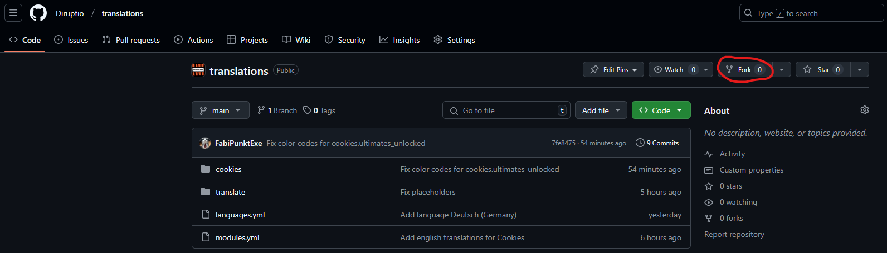
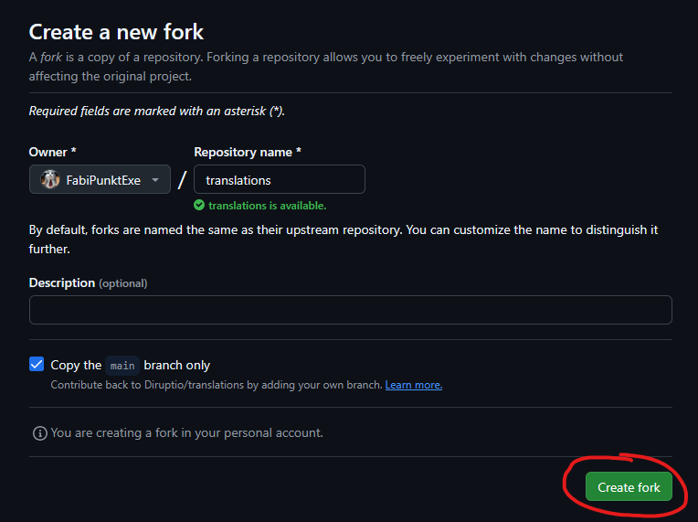
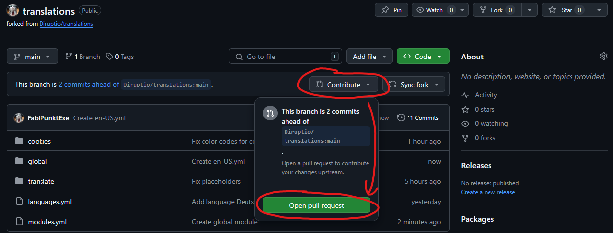
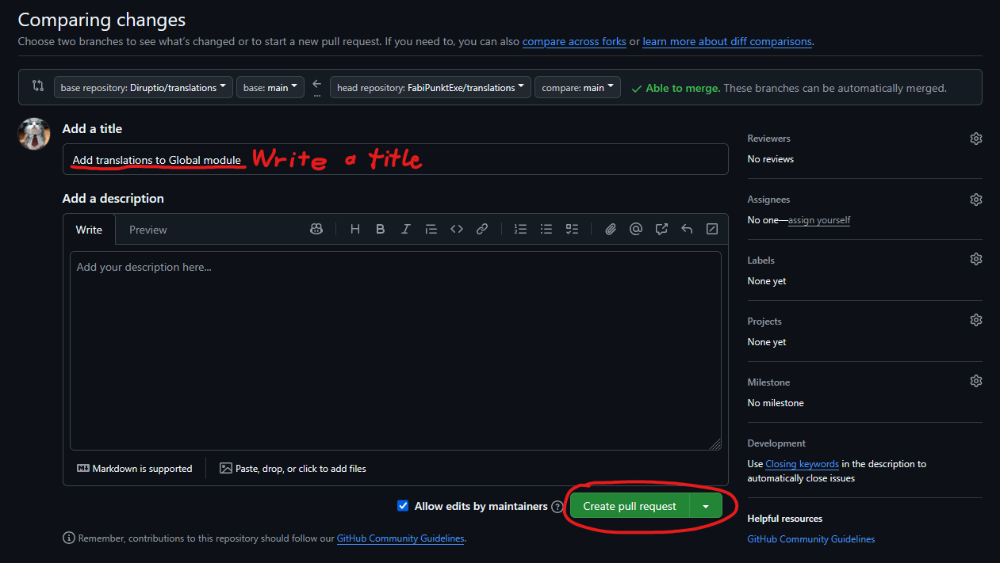

# Diruptio Translations
## How to contribute
1. Fork this repository
   
   
2. Make changes in your forked repository. Please follow the guidelines in the `guides` directory for your language.
3. Create a pull request
   
   
4. We will merge your pull request soon
